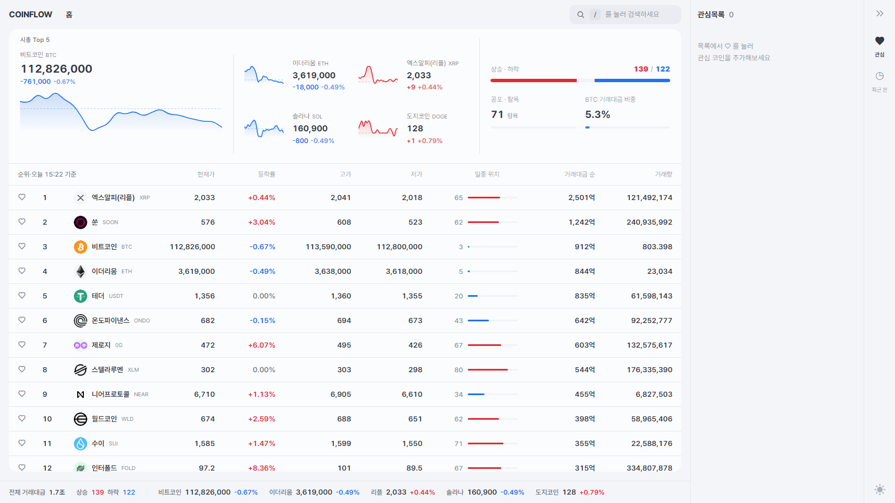
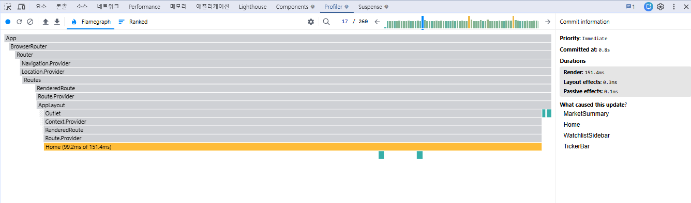
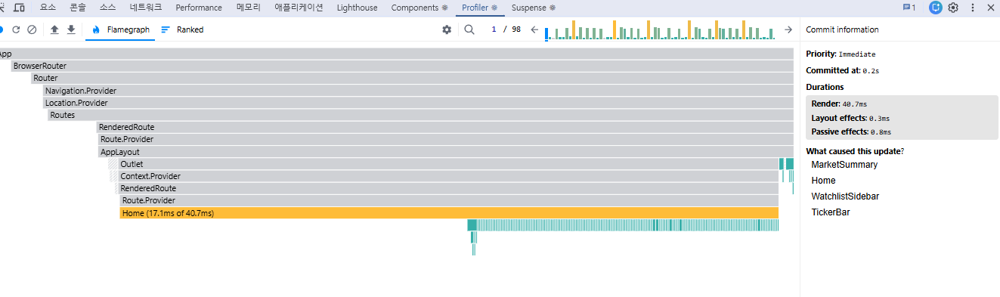
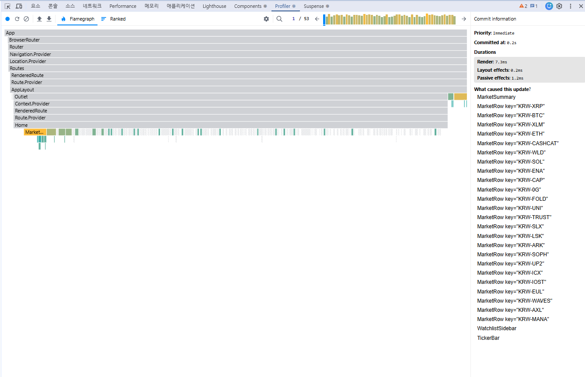

# COINFLOW — 암호화폐 실시간 시세

업비트 공개 API로 암호화폐 실시간 시세를 보여주는 웹앱입니다.

[](https://coinflow-bwj.vercel.app)
[](https://react.dev)
[](https://www.typescriptlang.org)
[](https://vitejs.dev)



> **안내** — UI 레이아웃은 토스증권 데스크톱 화면을 참고한 **학습용 클론**입니다.
> 토스증권과는 무관하며, 시세 데이터는 업비트 공개 API(공포·탐욕 지수만 alternative.me)에서 가져옵니다.

<br>

## 목차

1. [프로젝트 개요](#프로젝트-개요)
2. [주요 기능](#주요-기능)
3. [기술 스택과 선택 이유](#기술-스택과-선택-이유)
4. [아키텍처](#아키텍처)
    - [데이터 공급과 소비의 분리](#데이터-공급과-소비의-분리)
    - [소켓 구성](#소켓-구성--연결은-하나로-모든-스트림은-200ms-배칭)
    - [API 프록시](#api-프록시)
    - [폴더 구조](#폴더-구조)
5. [성능 최적화](#성능-최적화)
    - [배운 점](#배운-점)
6. [접근성](#접근성)
7. [실행 방법](#실행-방법)

<br>

## 프로젝트 개요

- 업비트 KRW 마켓의 코인 목록과 시세를 REST로 한 번 받아 오고, 이후 WebSocket으로 실시간 갱신합니다.
- 퍼블리셔에서 프론트엔드 개발자로 전환하는 과정에서 만든 개인 포트폴리오입니다.
- **데스크톱 전용**(최소 1280px)이며 모바일 대응은 하지 않았습니다.

<br>

## 주요 기능

**홈**

- KRW 마켓 전체 시세 테이블 — 현재가 · 등락률 · 고가 · 저가 · 일중 위치 · 거래대금 · 거래량
- 등락률이 바뀌면 셀 배경이 상승/하락색으로 깜빡임 (가격엔 색을 입히지 않고 등락률에만 — 토스 규칙)
- 상단 시장 요약 — 대표 코인 스파크라인, 상승/하락 종목 수, 공포·탐욕 지수

**검색**

- `/` 키 또는 GNB 버튼으로 여는 검색 팝업
- 입력 전엔 인기 코인(거래대금 순) · 급상승 코인 TOP 5, 입력하면 한글명/심볼로 필터
- ↑↓ 탐색 · Enter 이동 · ESC 지우기/닫기, 한글 조합 중 키 입력 무시

**관심 · 최근 본**

- 오른쪽 패널에서 관심 코인과 최근 본 코인을 현재가 / 전일 대비 2줄로 표시 (localStorage 유지)

**코인 상세**

- 헤더 — 현재가 · 어제 대비 · 1일/52주 범위 막대 · 거래대금 순위 · 체결강도 · 오늘 매수/매도 체결량
- 패널 대시보드
    - 차트 — 분/일/주/월/년 캔들 (lightweight-charts)
    - 기간별 수익률 — 1주 · 1개월 · 3개월 · 6개월 · 1년 전 대비 등락률
    - 시세 — 실시간 체결 / 일별 시세 전환
    - 매수·매도 비중 — 오늘 누적 · 최근 N건 비율, 큰 체결 TOP 5
    - 종목정보 — 시가 · 전일 종가 · 24h 거래대금/거래량 · 52주 최고/최저와 날짜

**공통**

- 다크 / 라이트 테마 (OS 설정 자동 감지 · localStorage 유지 · FOUC 없음)

<br>

## 기술 스택과 선택 이유

| 분류      | 사용 기술                             |
| --------- | ------------------------------------- |
| 빌드      | Vite 8                                |
| UI        | React 19, TypeScript 6                |
| 라우팅    | react-router-dom 7 (선언형 라우팅)    |
| 전역 상태 | Zustand 5                             |
| 스타일    | CSS Modules + CSS 변수 디자인 토큰    |
| 차트      | lightweight-charts 5                  |
| 폰트      | Pretendard (npm 패키지로 자체 호스팅) |
| 포맷터    | Prettier (홑따옴표·세미콜론 없음·4칸) |

**Next.js가 아닌 Vite**
실시간 시세는 브라우저가 WebSocket으로 받아 그리는 클라이언트 중심 앱이라 SSR이 필요하지 않았습니다. 설정이 가벼운 Vite SPA로 충분하다고 판단했습니다.

**Context가 아닌 Zustand**
Context는 값이 바뀌면 그 Context를 구독하는 컴포넌트가 전부 리렌더됩니다. 시세는 초당 수십 번 갱신되기 때문에, 컴포넌트가 필요한 값만 골라 구독하는 **선택적 구독**이 필요했습니다.

```ts
// 각 행은 자기 코인의 시세만 구독
const live = useMarketStore((s) => s.liveMap[market])
```

**Tailwind가 아닌 CSS Modules**
퍼블리셔로 쌓아 온 CSS 설계 역량을 드러내고 싶었습니다. 색상·간격 등은 `tokens.css`의 CSS 변수로 관리하고, 다크/라이트 테마는 `data-theme` 속성으로 토큰 값을 바꿉니다.

<br>

## 아키텍처

### 데이터 공급과 소비의 분리

```
AppLayout
 └─ useMarketFeed()                 ← 앱 전체에서 한 번만 호출
     ├─ REST 스냅샷 (1회)            : 목록 · 순서 · 한글명
     └─ 스트림 ① ticker             : KRW 전체 시세, 200ms 배칭
            │
            ▼
      Zustand 스토어 (market)
            │  읽기만 함
   ┌────────┬─────────┬──────────────┬─────────────────┬─────────────┐
  Home   MarketRow  TickerBar  MarketSummary  관심·최근 사이드바  검색 팝업

CoinDetail (/coins/:market)         ← 상세 페이지에 있는 동안만
 ├─ 스토어 liveMap[market]  → 스트림 ①에서 이 코인만 구독
 └─ useUpbitTrades(market)  → REST 최근 100건 + 스트림 ② trade : 체결 내역 (200ms 배칭)
```

- **공급**: `AppLayout`에서 `useMarketFeed()`를 한 번 호출합니다. 이 훅이 REST 스냅샷을 1회 받고 스트림 ①을 구독해 스토어에 기록합니다.
- **소비**: 목록성 화면(홈 테이블, 티커 바, 시장 요약, 사이드바, 검색 팝업)은 스토어에서 읽기만 합니다. 상세 페이지의 거래대금 순위도 이 스토어로 계산합니다.
- **역할 분담**: REST는 목록·순서·한글명을 담당하고(1회), WebSocket은 시세 갱신을 담당합니다(지속).

### 소켓 구성 — 연결은 하나로, 모든 스트림은 200ms 배칭

초기에는 시세가 필요한 컴포넌트마다 각자 WebSocket을 열어서, **같은 데이터**를 받는 소켓이 3개 동시에 떠 있었습니다. 그래서 데이터를 **받아 오는 곳(공급)** 과 **그리는 곳(소비)** 을 나눠, 시세는 스트림 ① 하나를 스토어로 공유하도록 통합했습니다.

| 스트림   | 대상           | 반영 방식                                                   | 수명        |
| -------- | -------------- | ----------------------------------------------------------- | ----------- |
| ① ticker | KRW 전체       | 200ms 배칭 → 스토어 (상세 페이지도 여기서 자기 코인만 구독) | 앱 전체     |
| ② trade  | 상세 코인 체결 | 200ms 배칭 → 최근 100건, 페이지 로컬 상태                   | 상세 페이지 |

- 한때 상세 코인 시세를 **메시지마다 즉시 반영**하는 스트림을 따로 뒀지만, 초당 수십 번 상세 페이지 전체(헤더 + 패널 5개)를 리렌더시키면서 얻는 건 **최대 200ms 빠른 표시**뿐이라 제거하고 ① 스토어에서 읽도록 바꿨습니다. 체결 스트림도 같은 이유로 배칭합니다.
- 전 종목 집계(상승·하락 종목 수, 전체 거래대금, 거래대금 순위)는 **배치를 반영할 때 스토어에서 한 번만** 계산합니다. 컴포넌트는 결과 원시값만 구독해 값이 실제로 바뀔 때만 리렌더됩니다.
- ②는 effect cleanup에서 구독 해제되므로, 상세 페이지를 벗어나면 스트림 ①만 남습니다.

**물리적 연결은 1개**입니다. 업비트는 웹사이트 Origin으로 들어온 브라우저 소켓을 동시에 1개 정도만 허용해서(localhost는 예외라 배포 후에야 드러남), 스트림마다 소켓을 열면 상세 페이지에서 연결 직후 끊겼습니다. 그래서 `upbitSocket.ts`가 연결 하나를 공유하고,

- 구독이 바뀌면 ①②를 합친 **구독 메시지만 다시 전송**합니다 (코인 이동 시 재연결 없음)
- 받은 메시지를 `type`·`code`가 맞는 구독자에게만 전달합니다
- 연결이 끊기거나 거부되면 1s → 2s → 4s … (최대 30s) 간격으로 재연결하고 구독을 복원합니다

### API 프록시

브라우저에서 업비트 REST를 직접 호출하면 요청에 `Origin` 헤더가 붙습니다. 업비트는 Origin이 있는 요청을 별도 그룹으로 분류해 **초당 약 1회**로 제한하는데, 코인 목록(200개 이상)과 실시간 시세를 동시에 받아야 하는 이 앱에서는 한계가 금방 옵니다. `api/upbit.ts`(Vercel 서버 함수)를 프록시로 두어 서버에서 Origin 없이 업비트를 호출하고 응답을 그대로 넘기는 방식으로 이를 우회했습니다.

```
브라우저 → /upbit/:path  →  api/upbit.ts  →  api.upbit.com/v1/:path
                (Origin 없음)
```

설계에서 신경 쓴 세 가지입니다.

**열린 프록시 방지**
경로를 그대로 포워딩하면 누구나 업비트의 임의 엔드포인트를 이 서버를 통해 호출할 수 있습니다. `ALLOWED` 정규식으로 이 앱이 실제로 쓰는 경로만 허용하고, 그 외 요청은 400으로 거부합니다.

```ts
const ALLOWED = /^(market\/all|ticker|trades\/ticks|candles\/(minutes\/(1|15|60)|days|weeks|months))$/
```

**엔드포인트별 엣지 캐시 분리**
모든 응답에 같은 캐시 정책을 적용하면 시세가 낡거나 마켓 목록이 과도하게 재요청됩니다. 변경 주기가 다른 엔드포인트를 다르게 처리했습니다.

| 엔드포인트     | `s-maxage` | 이유                                 |
| -------------- | ---------- | ------------------------------------ |
| `market/all`   | 3600s      | 마켓 목록은 하루에도 거의 안 바뀜   |
| 시세 · 캔들   | 1s         | 실시간성이 중요하므로 거의 무효화   |

**업스트림 실패 처리**
업비트 서버 연결에 실패하면 502를 반환합니다. `upbitApi.ts`의 `fetchUpbit`는 502를 받으면 재시도하도록 연결돼 있어, 일시적인 업스트림 장애를 클라이언트가 자동으로 극복합니다.

### 폴더 구조

```
src/
├─ layouts/        AppLayout, Gnb, RailNav — 화면 골격
├─ pages/          Home, CoinDetail — 라우트 단위 페이지 (데이터 로딩 + 배치)
├─ features/       기능 단위. 그 기능에서만 쓰는 훅·CSS도 함께 둠
│  ├─ chart/           ChartPanel, CandleChart
│  ├─ coin-header/     CoinHeader, RangeRow, useTradeRank
│  ├─ coin-info/       CoinInfoPanel
│  ├─ market-list/     MarketTable, MarketRow, DayRangeBar, useFlash
│  ├─ market-summary/  MarketSummary, MarketStats, MarketBreadth, useSparklines, useFearGreed
│  ├─ returns/         ReturnsPanel, usePeriodBases
│  ├─ search/          SearchButton, SearchModal
│  ├─ sidebar/         WatchlistSidebar, RecentSidebar, CoinListItem, Quote
│  ├─ ticker-bar/      TickerBar
│  └─ trades/          QuotesPanel, TradeList, DailyList, TradeFlowPanel, useDailyCandles
└─ shared/         두 곳 이상에서 쓰는 것만
   ├─ api/         upbitApi(REST 주소), upbitSocket(소켓 연결),
   │               useMarketFeed, useUpbitTrades
   ├─ hooks/       useScrollFade
   ├─ lib/         format(순수 포맷 함수), metrics(계산 함수)
   ├─ store/       market, watchlist, recent, ui (Zustand)
   ├─ ui/          Panel, Segmented, Price, ChangeRate, CoinLogo, Sparkline, WatchButton, ThemeToggle
   ├─ styles/      reset.css, tokens.css, direction.module.css(등락 색)
   └─ types.ts
```

- **의존 방향**: `pages → features → shared` 한 방향만 허용하고, feature끼리는 서로 import하지 않습니다.
- **shared 기준**: 한 기능에서만 쓰는 훅은 그 feature 폴더에 두고, 두 곳 이상에서 쓸 때 `shared`로 올립니다. 단 업비트 REST·소켓과 직접 통신하는 훅은 사용처 수와 관계없이 `shared/api`에 모아 데이터 계층을 한곳에서 관리합니다.

<br>

## 성능 최적화

React DevTools Profiler로 **10초간** 측정한 수치입니다.

| 단계                        | 커밋 수 | 최대 렌더 시간        |
| --------------------------- | ------- | --------------------- |
| 최적화 전                   | 260회   | 151.4ms (Home 99.2ms) |
| WebSocket 배칭 적용         | 98회    | 40.7ms (Home 17.1ms)  |
| useMemo 집계                | 124회   | (변화 없음)           |
| flash DOM 조작 + React.memo | 53회    | 7.3ms                 |
| 배칭 일원화 + 집계 파생화   | → [추가 측정](#추가-측정-파생-상태-도입과-배칭-우회-제거) | 홈 렌더합계 −28% / 상세 커밋 −33% |

**최종 결과: 커밋 수 79.6% 감소, 최대 렌더 시간 95.2% 감소(약 20.7배)**

| 최적화 전                                | 배칭 적용 후                                  | 최종                               |
| ---------------------------------------- | --------------------------------------------- | ---------------------------------- |
|  |  |  |

### 추가 측정: 파생 상태 도입과 배칭 우회 제거

위 작업 이후에도 배칭을 거치지 않는 경로(상세 페이지의 메시지별 `setState`, `liveMap` 전체를 구독하는 집계 컴포넌트)가 남아 있어 정리했습니다. React `<Profiler>` API로 루트 커밋을 **10초 × 3회** 측정한 중앙값입니다(헤드리스 Chrome, 개발 빌드). 위 표(DevTools)와 측정 도구가 달라 두 표의 절대값은 직접 비교하지 않습니다.

| 화면       | 단계             | 커밋 수         | 렌더 합계          | 최대 렌더 |
| ---------- | ---------------- | --------------- | ------------------ | --------- |
| 홈         | 적용 전          | 46회            | 344.8ms            | 13.0ms    |
| 홈         | 파생 상태 적용   | 49회            | **249.7ms (−28%)** | 14.2ms    |
| 상세 (BTC) | 적용 전          | 61회            | 253.5ms            | 17.3ms    |
| 상세 (BTC) | 스트림 배칭 적용 | **41회 (−33%)** | **159.9ms (−37%)** | 19.5ms    |

- 홈의 **커밋 수는 그대로**입니다. 커밋 횟수는 200ms 배치 주기가 정하고, 줄어든 건 커밋 한 번에 다시 그려지는 **범위**입니다.
- 상세 페이지는 시세·체결 스트림을 배칭해 **커밋 수 자체**가 줄었습니다.
- 최대 렌더 시간은 회차마다 12~24ms로 흔들려 의미 있는 차이가 없습니다.

### 1. WebSocket 배칭

메시지가 올 때마다 `setState`를 하던 구조를, **Map 버퍼**에 모았다가 **200ms 주기로 한 번에** 스토어에 반영하도록 바꿨습니다.

Map을 쓴 이유는 같은 코인의 시세가 한 주기 안에 여러 번 와도 **코드를 키로 덮어써서 최신값 하나만** 남기기 위해서입니다. 버퍼링과 중복 제거를 한 번에 해결합니다.

```ts
ws.onmessage = (event) => {
    const d = JSON.parse(new TextDecoder().decode(event.data))
    bufferRef.current.set(d.code, d) // 같은 코인은 최신값으로 덮어씀
}

setInterval(() => {
    if (bufferRef.current.size === 0) return
    applyLiveBatch(Array.from(bufferRef.current.values()))
    bufferRef.current.clear()
}, 200)
```

### 2. 가격 플래시: setState → ref + classList

가격이 바뀔 때 깜빡이는 효과를 `setState`로 켜고 끄고 있었습니다. 가격 변동 1회당 `setState`가 2번(켜기/끄기) 일어나서, 이것이 **커밋 폭증의 주원인**이었습니다.

애니메이션은 화면의 데이터를 바꾸는 렌더링이 아니라 **DOM에 클래스를 붙였다 떼는 일**이라고 판단해, ref로 요소를 잡고 `classList`를 직접 조작하도록 바꿨습니다.

```ts
el.classList.remove(styles.flashUp, styles.flashDown)
void el.offsetWidth // 애니메이션 재시작
el.classList.add(cls)
const timer = setTimeout(() => el.classList.remove(cls), 900)
```

측정 이후에는 이 로직을 `useFlash` 훅으로 분리했고, 토스처럼 **가격이 아닌 등락률 셀 배경**만 깜빡이도록 옮겼습니다. 사이드바·티커 바 등 나머지 화면은 깜빡임 없이 표시합니다.

```tsx
// MarketRow — 현재가가 바뀌면 등락률 셀 전체가 깜빡임
const rateCellRef = useFlash<HTMLSpanElement>(tradePrice, getDirection(changeRate))
<span role="cell" ref={rateCellRef} className={styles.rateCell}>
  <ChangeRate rate={changeRate} />
</span>
```

### 3. MarketRow를 memo로 감싸고 선택 구독

`MarketRow`를 `React.memo`로 감싸고, 각 행이 스토어에서 **자기 코인만** 구독하게 했습니다. `Home`은 더 이상 `liveMap`을 구독하지 않으므로 시세가 바뀌어도 리렌더되지 않고, **289개 행 중 실제로 값이 바뀐 행만** 리렌더됩니다(측정 시 24개).

### 4. memo가 동작하려면 props가 원시값이어야 함

처음에는 `coin` 객체를 통째로 props로 넘겼는데, 부모가 렌더될 때마다 새 객체가 만들어져 memo의 얕은 비교가 항상 실패했습니다. 필요한 값만 원시값으로 풀어서 넘기도록 바꿨습니다.

```tsx
// Before: <MarketRow coin={coin} />  → 매번 새 객체, memo 무효
<MarketRow
  market={coin.market}
  koreanName={coin.koreanName}
  rank={index + 1}
  fallbackPrice={coin.tradePrice}
  ...
/>
```

### 5. useMemo 집계 → 스토어 파생 상태로 해결

시세 집계 계산을 `useMemo`로 감쌌지만 **효과가 없었습니다**(커밋 98회 → 124회, 렌더 시간 변화 없음). `liveMap`이 200ms마다 새 객체로 교체되기 때문에 의존성이 매번 바뀌어 메모가 한 번도 재사용되지 않았습니다. 측정해 보니 병목은 **연산량이 아니라 렌더 횟수와 범위**였습니다.

문제의 구조적 원인은 "매번 새 객체인 `liveMap`을 각 컴포넌트가 따로 구독해 집계를 중복 계산하는 것"이었습니다. 그래서 집계 자체를 스토어로 옮겼습니다. `applyLiveBatch`가 배치를 반영할 때 상승·하락 종목 수, 전체 거래대금, 거래대금 순위를 **한 번만** 계산해 스토어 필드로 두고, 컴포넌트는 그 원시값만 구독합니다. 컴포넌트마다 돌던 전 종목 순회가 배치당 1회로 줄고, 홈의 렌더 합계가 28% 줄었습니다([추가 측정](#추가-측정-파생-상태-도입과-배칭-우회-제거) 참고).

### 배운 점

"측정 없이 최적화하지 않는다"는 원칙으로 단계마다 Profiler 수치를 남겼습니다. 효과가 있을 거라 예상한 useMemo는 효과가 없었고, 원인은 계산이 아닌 곳에 있었습니다. 예상과 실제가 다를 수 있다는 걸 수치로 확인했습니다.

<br>

## 접근성

퍼블리셔 배경을 살려 WCAG 기준으로 키보드·스크린리더 접근성을 별도로 작업했습니다.

**제목 구조 (h1)**
페이지에 `<h1>`이 없으면 스크린리더 사용자가 페이지를 파악하기 어렵습니다. 홈에는 시각적으로 숨긴 `<h1 class="srOnly">KRW 마켓 실시간 시세</h1>`를, 코인 상세에는 코인명을 `<h1>`으로 마크업했습니다. `.srOnly`는 `clip-path: inset(50%)`를 쓰는 표준 숨김 유틸 클래스로 `reset.css`에 정의했습니다.

**마켓 테이블 키보드 접근**
289개 행이 `div + onClick`으로만 구현돼 Tab으로 도달할 수 없었고, Ctrl+클릭으로 새 탭을 열 수도 없었습니다. 코인명 셀을 `<Link>`로 복원해 두 문제를 한 번에 해결했습니다. 행 전체의 `onClick`은 마우스 편의용으로 유지합니다.

**aside 키보드 격리**
사이드바가 닫혔을 때 `aria-hidden`만 있으면 마우스는 막히지만 Tab 포커스는 여전히 화면 밖 요소로 들어갑니다. React 19의 `inert` 속성으로 바꿔 키보드 접근과 AT 노출을 함께 차단했습니다.

**검색 모달 포커스 관리**
`role="dialog" aria-modal="true"` 선언만으로는 포커스가 모달 밖으로 빠져나갑니다. 네 가지를 추가했습니다.

- **포커스 트랩**: Tab/Shift+Tab이 모달 안 첫·마지막 포커서블 요소 사이를 순환합니다.
- **포커스 복원**: 마운트 시 `document.activeElement`를 저장해 닫을 때 되돌립니다.
- **Escape 범위 확대**: `onKeyDown`을 `<input>`에서 `.modal` div로 올려, 결과 버튼에 포커스가 있어도 Escape로 닫힙니다.
- **ARIA 패턴**: `<input role="combobox" aria-activedescendant>`, `<ul role="listbox">`, `<button role="option" aria-selected>`로 스크린리더에 현재 선택 항목을 전달합니다.

**Segmented 탭 키보드**
`role="radiogroup/radio"`는 라디오 그룹 패턴이라 화살표 키 이동과 roving tabindex가 없었습니다. 패널 전환 용도에 맞게 `role="tablist/tab"`으로 바꾸고, 선택된 탭만 `tabIndex=0`, 나머지는 `-1`로 설정해 ←→ 키로 탭 간 이동이 되도록 했습니다.

**차트 드롭다운**
분봉 선택 드롭다운에 `aria-expanded`, `aria-haspopup="listbox"`, `type="button"`을 추가하고 Escape 키와 바깥 클릭으로 닫히게 했습니다.

> 테스트 자동화는 도입하지 않았습니다. 실제 브라우저에서 키보드 탐색과 VoiceOver로 직접 확인했으며, 자동화 테스트는 다음 과제입니다.

<br>

## 실행 방법

Node.js **18 이상**이 필요합니다. `.env` 파일은 필요 없습니다(API 키 없이 업비트 공개 API를 사용합니다).

```bash
npm install
npm run dev      # 개발 서버 (http://localhost:5173)
npm run build    # 타입 체크 + 프로덕션 빌드
npm run preview  # 빌드 결과 미리보기
npm run format   # Prettier 전체 포맷
```

배포는 Vercel에 연결된 저장소를 push하면 자동 빌드됩니다. `vercel.json`의 rewrites가 `/upbit/*` 요청을 `api/upbit.ts` 서버 함수로 라우팅합니다.
